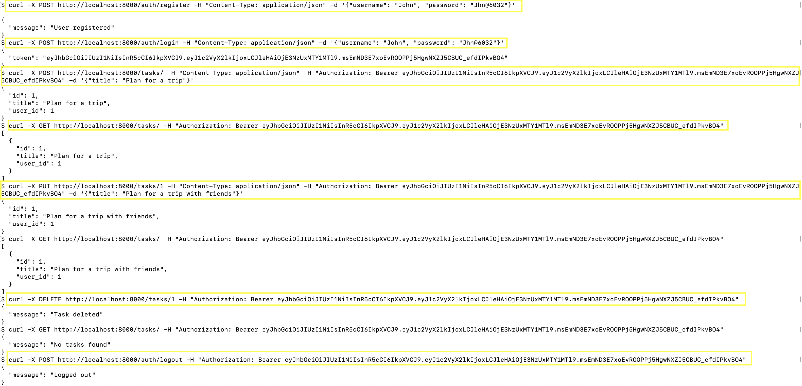

# My Projects

Below are some of the projects I’ve built. Click the links to view the code on GitHub or see live demos (if available).

---

## Task Manager API
**Technologies**: Flask, JWT Authentication, JSON storage  
**Description**: A simple **Task Manager API** built using **Flask** that supports user authentication, task creation, updating, deletion, and listing. **JWT authentication** is used for secure user management. This project is a great example of how to handle user-specific data, authentication, and CRUD operations using Flask.

**Features**:
- User registration and login using **JWT tokens** for authentication.
- Create, read, update, and delete tasks with user-specific access.
- Simple **JSON storage** to store users and tasks (ideal for small projects or prototypes).
- Secure API routes with **JWT-based authentication**.

**GitHub**: [View Repository](https://github.com/rs-jayanth/flask-auth-crud)  

**Screenshot**:  

---

*More projects coming soon…*